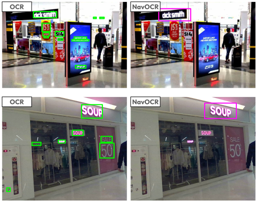

# NavOCR

A lightweight, navigation-oriented OCR framework.

It is designed for robotic navigation scenarios, where only navigation-relevant text should be detected, such as:

- Signboards
- Room numbers

while irrelevant text, such as advertisements or price tags, is ignored.

## Key features

- Focuses on navigation-relevant text to reduce unnecessary information and improve OCR speed
- Supports both standalone and ROS 2 integration
- Optimized for CPU-first robotic platforms, achieving ~6 FPS on CPUs
- Supports PaddlePaddle and Pytorch for GPU environments


<p align="center">
    

<p align="center">
    
</p>

## Dataset Generator (for NeurIPS 2026 ED track submission)

All files for the Dataset Generator are located in the top-level `dataset_generator/` directory.
If you are interested in model inference instead of dataset generation, go directly to [Installation](#installation) and [Standalone Inference](#standalone-inference).

The `dataset_generator/` package builds a COCO-format training dataset from crawled storefront images:

1. Prepare crawled storefront images and an image-level `manifest.csv`.
2. CLIP-filter: Use CLIP to filter images that look like store exteriors.
3. Run PaddleOCR on the filtered images.
4. OCR-filter: Keep OCR boxes whose text is similar to the target store name.
5. Export the selected images and boxes as a COCO-format train/val/test dataset under `data/preprocessed/<run_id>/`.

The intermediate progress of each image is stored in `manifest.csv`, and OCR box results are stored in `detections.csv`, so the pipeline can be resumed after a partial run.

**Note.** This implementation corresponds to the Dataset Generation section of the paper. The other implementations are included in this repository, but the first step, image collection using open map resources and search engines, is currently omitted. This is because the Google Search API we used recently stopped accepting new users. A Selenium-based replacement is possible, but we have not yet reached a clear conclusion about its terms of use. We will organize and add the image collection component in a usable form soon.

Files:

- `dataset_generator/runner.py`: CLI entry point and stage orchestrator
- `dataset_generator/manifest_io.py`: CSV schemas and IO helpers for `manifest.csv` and `detections.csv`
- `dataset_generator/clip_filter.py`: CLIP-based storefront/signboard image filter
- `dataset_generator/ocr_runner.py`: PaddleOCR runner for images that pass the CLIP filter
- `dataset_generator/ocr_filter.py`: Levenshtein-based filter that selects OCR boxes matching the target store name
- `dataset_generator/coco_exporter.py`: train/val/test split assignment and COCO JSON export
- `scripts/check_dataset_generator_env.py`: optional dependency and smoke-test checker

Run:

```bash
# Optional environment check
python scripts/check_dataset_generator_env.py

# Direct module execution
python -m dataset_generator.runner --run-id <run_id>

# After editable install
pip install -e .[dataset_generator]
generate_navocr_dataset --run-id <run_id>
```

Expected input layout:

```text
data/raw/<run_id>/images/
data/<run_id>/manifest.csv
```

Default output layout:

```text
data/<run_id>/detections.csv
data/preprocessed/<run_id>/images/{train,val,test}/
data/preprocessed/<run_id>/annotations/instances_{train,val,test}.json
```

## Overview

- `navocr_standalone.py`: Run detection + OCR on a single image or a directory
- `navocr/ros_node.py`: ROS 2 node entry point
- `configs/navocr_onnx.params.yaml`: ONNX detector + ONNX OCR config (default)
- `configs/navocr_openvino.params.yaml`: OpenVINO detector + OpenVINO OCR config
- `configs/navocr_paddle.params.yaml`: PaddleDetection detector + Paddle OCR config
- `configs/navocr_pytorch.params.yaml`: PyTorch detector + Paddle OCR config

## Backend Composition

| Model format | Runtime / engine | Hardware  | Text detection | Text recognition | FPS |
| ------------ | ---------------- | --------- | -------------- | ---------------- | --- |
| ONNX         | ONNX Runtime     | CPU / GPU | [RT-DETRv4](https://github.com/RT-DETRs/RT-DETRv4) (Fine-tuned) | [PP-OCRv5](https://github.com/PaddlePaddle/PaddleOCR) | 4.51 |
| OpenVINO IR  | OpenVINO Runtime | Intel CPU | [RT-DETRv4](https://github.com/RT-DETRs/RT-DETRv4) (Fine-tuned) | [PP-OCRv5](https://github.com/PaddlePaddle/PaddleOCR) | 6.07 |
| Paddle model | Paddle Inference | CPU / GPU | [PP-YOLOE](https://github.com/PaddlePaddle/PaddleDetection/blob/release/2.9/configs/ppyoloe/README.md) (Fine-tuned) | [PP-OCRv5](https://github.com/PaddlePaddle/PaddleOCR) | 1.79 |
| PyTorch      | PyTorch          | CPU / GPU | [RT-DETRv4](https://github.com/RT-DETRs/RT-DETRv4) (Fine-tuned) | [PP-OCRv5](https://github.com/PaddlePaddle/PaddleOCR) | 2.05 |

*All FPS was measured on 11th Gen Intel(R) Core(TM) i5-1135G7.

## Installation

### Download Model
ONNX, OpenVINO, PaddlePaddle models are included in this repository.

### Python Environment Setup (recommended)

Using a `venv` keeps NavOCR's Python dependencies isolated from the system Python and avoids conflicts with `colcon build`.

```bash
python3 -m venv ~/.venvs/navocr
source ~/.venvs/navocr/bin/activate

pip install --upgrade pip
pip install colcon-common-extensions
```

### For ONNX runtime (default)

```bash
pip install onnxruntime pyyaml opencv-python numpy
```

If you want to run ONNX Runtime on CUDA, install `onnxruntime-gpu` instead of `onnxruntime`.

### For OpenVINO runtime (Optional)

```bash
pip install openvino pyyaml opencv-python numpy
```

### For PyTorch runtime (Optional)

```bash
pip install pyyaml opencv-python numpy
pip install torch torchvision --index-url https://download.pytorch.org/whl/cpu

# Download weight
pip install gdown==5.2.0
gdown https://drive.google.com/uc?id=1D0zRUmyPvxgXq2rytrzVqg3-5_-5gkDn
mv rtv4_hgnetv2_s.pth model/pytorch/rtv4_hgnetv2_s.pth
```

### For Paddle runtime (Optional)

This is only required for paddlepaddle backend.

> Tested with `paddlepaddle==3.0.0` and `paddleocr==3.4.0`.

Install PaddlePaddle following the official installation guide for your OS / Python / CUDA version:

- https://www.paddlepaddle.org.cn/en/install/quick

Then install PaddleDetection and PaddleOCR:

```bash
pip install pyyaml opencv-python numpy

# PaddleDetection
git clone https://github.com/PaddlePaddle/PaddleDetection.git

cd PaddleDetection
pip install -r requirements.txt
python setup.py install

# PaddleOCR
pip install paddleocr
```

## Standalone Inference

The repository includes test images under `navocr_testset/images/test`.
Due to concerns about exposing nationality information, we did not include all test sets. Nevertheless, this analysis allows us to examine the model’s behavior.


### Run with ONNX runtime (default)
```bash
python navocr_standalone.py \
  --params-file configs/navocr_onnx.params.yaml \
  --infer_dir navocr_testset/images/test
```

### Run with OpenVINO runtime
```bash
# If you encounter oneDNN compatibility issues on CPU, set these before running:
export FLAGS_enable_pir_api=0
export FLAGS_enable_pir_in_executor=0

python navocr_standalone.py \
  --params-file configs/navocr_openvino.params.yaml \
  --infer_dir navocr_testset/images/test
```

### Run with PyTorch runtime
```bash
python navocr_standalone.py \
  --params-file configs/navocr_pytorch.params.yaml \
  --infer_dir navocr_testset/images/test
```

### Run with Paddle runtime
```bash
python navocr_standalone.py \
  --params-file configs/navocr_paddle.params.yaml \
  --infer_dir navocr_testset/images/test
```

### Single image
```bash
python navocr_standalone.py \
  --params-file configs/navocr_onnx.params.yaml \
  --input navocr_testset/images/test/20251223_140948.jpg
```


## ROS 2 Node

### Build ROS 2 package

ROS dependencies are declared in `package.xml`. Install them from the workspace root with:

```bash
cd ~/ros2_ws  # your ros2 workspace
rosdep install --from-paths src --ignore-src -r -y

colcon build --symlink-install --packages-select navocr
python -m colcon build --symlink-install --packages-select navocr  # if you're using venv

source install/setup.bash
```

### Run ros2 node

```bash
ros2 run navocr navocr_with_ocr_node
```

The default ROS 2 params file is `configs/navocr_onnx.params.yaml`.

If you want to select a different params file at runtime:
```bash
ros2 run navocr navocr_with_ocr_node --ros-args \
  -p params_file:=/absolute/path/to/configs/navocr_pytorch.params.yaml

ros2 run navocr navocr_with_ocr_node --ros-args \
  -p params_file:=/absolute/path/to/configs/navocr_openvino.params.yaml

ros2 run navocr navocr_with_ocr_node --ros-args \
  -p params_file:=/absolute/path/to/configs/navocr_paddle.params.yaml
```

Published topics:

- `detections_topic` default: `/navocr/detections`
- `annotated_image_topic` default: `/navocr/annotated_image`

## Acknowledgements

We gratefully acknowledge the open-source projects that made this work possible:
[RT-DETRv4](https://github.com/RT-DETRs/RT-DETRv4),
[PaddleDetection](https://github.com/PaddlePaddle/PaddleDetection),
[PaddleOCR / PP-OCRv5](https://github.com/PaddlePaddle/PaddleOCR),
[OpenVINO](https://github.com/openvinotoolkit/openvino), and
[ONNX](https://github.com/onnx/onnx).


## 🚧 Planned Updates
We're working on expanding support beyond store signboards detection model.
Stay tuned for upcoming features for broader navigation use cases.

- [x] Library migration due to a license issue (`ultralytics` -> `PaddleDetection`)
- [x] Alternative inference for higher FPS on CPU (Add `OpenVINO` support)
- [x] Integration with text recognition (PaddleOCR)
- [x] Integration with SLAM packages via ROS (TextMap)
- [ ] Model training scripts (Dataset crawling, model fine-tuning, ...)
- [ ] Floor sign detection
- [ ] Directional guide text detection

## License
This repository is licensed under the Apache License, Version 2.0.

This project includes code and configuration files derived from
PaddleDetection (https://github.com/PaddlePaddle/PaddleDetection) and
RT-DETRv4 (https://github.com/RT-DETRs/RT-DETRv4),
which are also licensed under the Apache License, Version 2.0.
